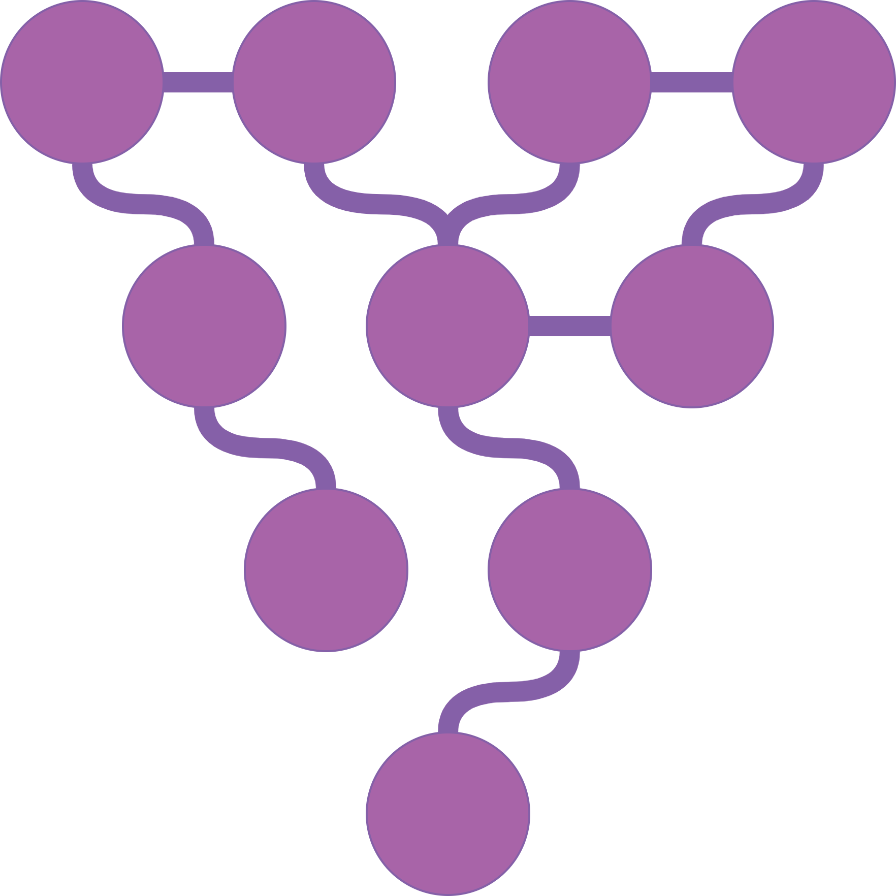

🍇 GRAPE
===================================
|pip| |downloads| |tutorials| |documentation| |python_version| |DOI| |license| |telegram| |discord| |twitter|

`GRAPE`_ (*Graph Representation leArning, Predictions and Evaluation*) is a fast graph processing and embedding library, designed to scale with big graphs and to run on both off-the-shelf laptop and desktop computers and High Performance Computing clusters of workstations.

The library is written in *Rust* and *Python* programming languages, and has been developed by `AnacletoLAB <https://anacletolab.di.unimi.it/>`_ (Dept. of Computer Science of the University of Milan), in collaboration with the `Robinson Lab - Jackson Laboratory for Genomic Medicine <https://www.jax.org/research-and-faculty/research-labs/the-robinson-lab>`_ and with the `BBOP - Lawrence Berkeley National Laboratory <http://www.berkeleybop.org/index.html>`_.

Installation of `GRAPE`_
----------------------------------------------
As usual, just install it from PyPi by running:

.. code:: shell

    pip install grape

It is possible to `manually compile Ensmallen <https://github.com/AnacletoLAB/ensmallen/blob/master/bindings/python/README.md>`_ for any OS, libc version, and CPU architecture (such as Arm, AArch64, RiscV, Mips) which are supported by Rust and LLVM. Just open an issue if you need some help.

Main functionalities of the library
----------------------------------------------

|features|

* Robust graph loading and graph retrieval:
    * 80K+ graphs
    * Support for multiple graph formats
    * human readable reports of graph characteristics
* 60+ Node embedding models, with easy integration of third parties libraries.
    * DeepWalk, Walklets and Node2Vec-based CBOW, SkipGram and GloVe
    * First and second order LINE
    * Unstructured, Structured Embedding, TransE
    * All embedding models have an MMAPP-ed versions to allow for very large embeddings
    * Integrated models from `Karate Club <https://github.com/benedekrozemberczki/karateclub>`_ and `PyKEEN <https://github.com/pykeen/pykeen>`_
* 20+ Classifier models, with easy integration of third parties libraries.
    * All sklearn models, adapted for edge prediction, edge-label prediction and node-label prediction
    * GraphSAGE and Kipf GCN for edge prediction, edge-label prediction and node-label prediction
    * Baseline Perceptron for edge prediction
* Graph processing: if NetworkX has it, odds are good we have it and it is way faster!
    * Resnik, Jaccard, Ancestors Jaccard similarities
    * Diameter, Vertex cover, connected components, Triangles
    * Filters on graph properties and set operations on graph edges
* Graph visualization tools
    * TSNE, UMAP, PCA of embeddings
    * Edge properties

Tutorials
----------------------------------------------
You can find tutorials covering various aspects of the GraPE library `here <https://github.com/AnacletoLAB/grape/tree/main/tutorials>`_.
All tutorials are as self-contained as possible and can be immediately executed on COLAB.

If you believe that any example may be of help, do feel free to `open a GitHub issue describing what we are missing in this tutorial <https://github.com/AnacletoLAB/grape/issues/new>`_.

Documentation
----------------------------------------------

On line documentation (currently being updated)
~~~~~~~~~~~~~~~~~~~~~~~~~~~~~~~~~~~~~~~~~~~~~~~~~
The on line documentation of the library is available `here <https://anacletolab.github.io/grape/index.html>`__.
Since Ensmallen is written in Rust, and PyO3 (the crate we use for the Python bindings), `doesn't support typing <https://github.com/PyO3/pyo3/issues/510>`_, the documentation is obtained generating an empty skeleton package. This allows to have a proper documentation but you won't be able to see the source-code in it. 

Using the automatic method suggestions utility
~~~~~~~~~~~~~~~~~~~~~~~~~~~~~~~~~~~~~~~~~~~~~~
To aid working with the library, GRAPE provides an integrated recommender system meant to help you either to find a method or, if a method has been renamed for any reason, find its new name.

As an example, after having loaded the `STRING Homo Sapiens graph <https://string-db.org/cgi/organisms>`_, the function for computing the connected components can be retrieved by simply typing components as follows: 

.. code:: python

    from grape.datasets.string import HomoSapiens

    graph = HomoSapiens()
    graph.components

The code above will raise the following error, and will suggest methods with a similar or related name:

.. code-block:: python

    AttributeError                            Traceback (most recent call last)
    <ipython-input-3-52fac30ac7f6> in <module>()
    ----> 2 graph.components

    AttributeError: The method 'components' does not exists, did you mean one of the following?
    * 'remove_components'
    * 'connected_components'
    * 'strongly_connected_components'
    * 'get_connected_components_number'
    * 'get_total_edge_weights'
    * 'get_mininum_edge_weight'
    * 'get_maximum_edge_weight'
    * 'get_unchecked_maximum_node_degree'
    * 'get_unchecked_minimum_node_degree'
    * 'get_weighted_maximum_node_degree'

In our example the method we need for computing the graph components would be `connected_components`.

Now the easiest way to get the method documentation is to use Python's `help <https://docs.python.org/3/library/functions.html#help>`_
as follows:

.. code:: python

    help(graph.connected_components)

And the above will return you:

.. code-block:: rst

    connected_components(verbose) method of builtins.Graph instance
    Compute the connected components building in parallel a spanning tree using [bader's algorithm](https://www.sciencedirect.com/science/article/abs/pii/S0743731505000882).
    
    **This works only for undirected graphs.**
    
    The returned quadruple contains:
    - Vector of the connected component for each node.
    - Number of connected components.
    - Minimum connected component size.
    - Maximum connected component size.
    
    Parameters
    ----------
    verbose: Optional[bool]
        Whether to show a loading bar or not.
    
    
    Raises
    -------
    ValueError
        If the given graph is directed.
    ValueError
        If the system configuration does not allow for the creation of the thread pool.

Cite GraPE
----------------------------------------------
Please cite the following paper if it was useful for your research:

.. code:: bib

    @misc{cappelletti2021grape,
      title={GraPE: fast and scalable Graph Processing and Embedding}, 
      author={Luca Cappelletti and Tommaso Fontana and Elena Casiraghi and Vida Ravanmehr and Tiffany J. Callahan and Marcin P. Joachimiak and Christopher J. Mungall and Peter N. Robinson and Justin Reese and Giorgio Valentini},
      year={2021},
      eprint={2110.06196},
      archivePrefix={arXiv},
      primaryClass={cs.LG}
    }
    

.. |pip| image:: https://badge.fury.io/py/grape.svg
    :target: https://badge.fury.io/py/grape
    :alt: Pypi project
    
.. |features| image:: https://github.com/AnacletoLAB/grape/blob/main/images/sequence_diagram.png?raw=true
    :target: https://github.com/AnacletoLAB/grape
    :alt: Features

.. |downloads| image:: https://pepy.tech/badge/grape
    :target: https://pepy.tech/badge/grape
    :alt: Pypi total project downloads 

.. _Grape: https://github.com/AnacletoLAB/grape
.. _Ensmallen: https://github.com/AnacletoLAB/ensmallen

.. _Embiggen: https://github.com/monarch-initiative/embiggen

.. _AnacletoLAB: https://anacletolab.di.unimi.it/
.. _RobinsonLab: https://www.jax.org/research-and-faculty/research-labs/the-robinson-lab/
.. _BPOP: http://www.berkeleybop.org/index.html

.. |license| image:: https://img.shields.io/badge/License-MIT-blue.svg
    :target: https://opensource.org/licenses/MIT
    :alt: License

.. |tutorials| image:: https://img.shields.io/badge/Tutorials-Jupyter%20Notebooks-blue.svg
    :target: https://github.com/AnacletoLAB/grape/tree/main/tutorials
    :alt: Tutorials

.. |documentation| image:: https://img.shields.io/badge/Documentation-Available%20here-blue.svg
    :target: https://anacletolab.github.io/grape/index.html
    :alt: Documentation

.. |DOI| image:: https://img.shields.io/badge/DOI-10.48550/arXiv.2110.06196-blue.svg
    :target: https://doi.org/10.48550/arXiv.2110.06196
    :alt: DOI

.. |python_version| image:: https://img.shields.io/badge/Python-3.7+-blue.svg
    :target: https://pypi.org/project/embiggen/#history
    :alt: Supported Python versions

.. |twitter| image:: https://badges.aleen42.com/src/twitter.svg
    :target: https://twitter.com/grapelib
    :alt: Twitter

.. |telegram| image:: https://badges.aleen42.com/src/telegram.svg
    :target: https://t.me/grape_lib
    :alt: Telegram Group

.. |discord| image:: https://badges.aleen42.com/src/discord.svg
    :target: https://discord.gg/Nda2cqYvTN
    :alt: Discord Server

