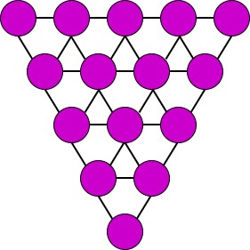

GraPE
===================================
|pip| |downloads|

`GraPE`_ (*Graph Processing and Embedding*) is a fast graph processing and embedding library, designed to scale with big graphs and to run on both off-the-shelf laptop and desktop computers and High Performance Computing clusters of workstations.

The library is written in *Rust* and *Python* programming languages, and has been developed by `AnacletoLAB`_  (Dept.of Computer Science of the University of Milan), in collaboration with the `RobinsonLab`_  (Jackson Laboratory for Genomic Medicine) and the `BPOP`_ (Lawrence Berkeley National Laboratory).

`GraPE`_ is composed of two main modules: `Ensmallen`_ (*ENabler  of  SMALL  runtimE  and  memory  Needs*) and `Embiggen`_ (*EMBeddInG  GENerator*), that run synergistically using parallel computation and efficient data structures.

`Ensmallen`_ efficiently executes graph processing operations including large-scale first and second-order random walks, while
`Embiggen`_ leverages the large amount of sampled random walks generated by `Ensmallen`_ by computing effective node and edge embeddings. 
Beside being helpful for unsupervised exploratory analysis of graphs, the computed embeddings can be used for trainining any of the flexible neural models for edge and node label prediction, provided by `Embiggen`_ itself.

Installation of `GraPE`_
----------------------------------------------
As usual, just download it using pip:

.. code:: shell

    pip install grape

Main functionalities of the library
----------------------------------------------
The `GraPE`_ library comes with a multitude of features, from dataset retrieval, to graph processing, node embedding, holdouts and visualization tools.

Loading a graph
~~~~~~~~~~~~~~~~~~~~~~~~~~~~~~~~~~~~~~~~~~~~~~
The `Ensmallen`_ library supports (un)directed (un)weighted (multi)graphs with both node types and edge types.

Specifically, the nodes can be provided with one or more node types from a node list, with the multiple node types separated by an arbitrary symbol.
Currently any given edge can have only an edge type assigned to it. There can be an arbitrary number of edges between any two given nodes.

In the example provided below, the node list is a TSV and the symbol used to separate the node types is a pipe (:code:`|`).

.. code:: plain

    node_name   node_type
    a_node_name a_node_type
    another_node_name   a_node_type|another_node_type

In the example below, the edge list is a TSV with four columns: :code:`source`, :code:`destination`, :code:`weight` and :code:`edge_type`. The column names are arbitrary and any column name may be used. The columns for the source and destination nodes must always be provided, while the weights and edge types columns are optional. Any other columns may exist in the TSV file and will be ignored while reading the file.

.. code:: plain

    source  destination weight  edge_type
    source_node_name    destination_node_name   3.0 an_edge_type
    another_source_node_name    destination_node_name   2.0 another_edge_type

The reference method to use to load a graph object from file is :code:`Graph.from_csv`. To read the complete documentation of the method, which is extensive, do run :code:`help(Graph.from_csv)`.

In the following, we report a brief example code for loading a TSV node list (saved in the TSV file "path/to/the/node_list.tsv") and the corresponding TSV edge list (saved in the TSV file "path/to/the/node_list.tsv").

.. code:: python

    from ensmallen import Graph

    graph = Graph.from_csv(
        edge_path="path/to/the/edge_list.tsv",
        sources_column="source",
        destinations_column="destination",
        weights_column="weights",
        edge_list_edge_types_column="edge_type",
        node_path="path/to/the/node_list.tsv",
        nodes_column="node_name",
        node_list_node_types_column="node_type",
        directed=False,
    )

Learn more on how to load a graph into `Ensmallen`_ `here on COLAB <https://colab.research.google.com/github/AnacletoLAB/grape/blob/main/tutorials/Loading_a_Graph_in_Ensmallen.ipynb>`_.

Automatic graph retrieval
~~~~~~~~~~~~~~~~~~~~~~~~~~~~~~~~~~~~~~~~~~~~~~
`Ensmallen`_ library includes an ever-increasing list of literature graphs, that can be automatically retrieved.

The following code prints all the complete list of graphs currently available from the library:

.. code:: python

    from ensmallen.datasets import get_all_available_graphs_dataframe
    get_all_available_graphs_dataframe()

The above code will output a dataframe as the following. It reports the source repository providing the graph, the name of the graph and its version (mutiple versions of the same graph are provided).

============  ======================================  ====================
repository    graph_name                              version
============  ======================================  ====================
string        AspergillusOryzae                       homology.v11.5
string        NitrospiraDefluvii                      links.v11.0
string        CandidaOrthopsilosis                    links.v11.5
string        DethiosulfatibacterAminovoransDsm17477  links.v11.5
string        CeleribacterEthanolicus                 physical.links.v11.5
string        SpiribacterSalinus                      links.v11.5
string        ChlorobiumLuteolum                      links.v11.0
string        PaenibacillusSwuensis                   links.v11.5
string        StreptomycesBingchenggensis             links.v11.5
string        DesulfurisporaThermophila               homology.v11.0
============  ======================================  ====================

The load a graph from a repository use the following code **pattern**:

.. code:: python

    from ensmallen.datasets.{repository} import {graph_name}

    graph = {graph_name}()

As an example, to retrieve graphs from `KGOBO <https://github.com/Knowledge-Graph-Hub/kg-obo>`_ you can use the following code snippet:

.. code:: python

    from ensmallen.datasets.kgobo import ZFS
    graph = ZFS()

You can learn more `on using the OBO graphs for computing several graph properties, embedding edges and nodes through a transE methos, and visualizing the embedded nodes and edges here on COLAB <https://colab.research.google.com/github/AnacletoLAB/grape/blob/main/tutorials/Ensmallen_Automatic_Graph_Retieval_KGOBO.ipynb>`_.

Similarly, to retrieve graphs from `STRING <https://string-db.org/>`_, for instance Homo Sapiens, you can use:

.. code:: python

    from ensmallen.datasets.string import HomoSapiens
    graph = HomoSapiens()

You can learn more `on using the STRING graphs here on COLAB <https://colab.research.google.com/github/AnacletoLAB/grape/blob/main/tutorials/Ensmallen_Automatic_Graph_Retrieval_STRING.ipynb>`_.

The same overall pattern applies to all other graph repositories. 

Random walks
~~~~~~~~~~~~~~~~~~~~~~~~~~~~~~~~~~~~~~~~~~~~~~
`Ensmallen`_ library provides a fast computation of weighted first and second order random walks, both exact and approximated (with dynamic neighbourhood subsampling). In the following example we load the HomoSapiens graph from String and we compute exact walks (*complete_walks*) and approximated walks (*sampled_walks*)

.. code:: python

    from ensmallen.datasets.string import HomoSapiens
    graph = HomoSapiens()

    complete_walks = graph.complete_walks(
        # We want random walks with length 100
        walk_length=100,
        # We want 2 iterations from each node
        iterations=2
    )
    
    sampled_walks = graph.random_walks(
        # We want random walks with length 100
        walk_length=100,
        # We want to get random walks starting from 1000 random nodes
        quantity=1000,
        # We want 2 iterations from each node
        iterations=2
    )

You can learn more `about running random walks using Ensmallen on COLAB here <https://colab.research.google.com/github/AnacletoLAB/grape/blob/main/tutorials/First_and_Second_order_random_walks_new.ipynb>`_.

Ensamllen provides many more featuring utilities:

* Preprocessing for node embedding and edge prediction:

    * Lazy generation of skip-grams from random walks
    * Lazy generation of balanced batches for edge prediction
    * GloVe co-occurence matrix computation
    
* Graph processing operations:

    * Optimized filtering by node, edge and components characteristics
    * Optimized algebraic set operations on graphs
    * Automatic generation of reports summarizing graph features in natural language
    
* Graph algorithms:

    * Breadth and Depth-first search
    * Dijkstra, Tarjan's strongly connected component
    * Efficient Diameter computation, spanning arborescence and connected components
    * Approximated vertex cover, triads counting, transitivity, clustering coefficient and triangles counting
    * Betweenness and stress centrality, Closeness and harmonic centrality
    
* Node embedding models:

    * SkipGram
    * CBOW
    * GloVe
    
* Edge and node prediction models:

    * Perceptron
    * Multi-Layer Perceptron
    * Deep Neural Networks
    
* Graph visualization tools: visualization of node and edge properties
        

Tutorials
----------------------------------------------
You can `find tutorials covering various aspects of the GraPE library here <https://github.com/AnacletoLAB/grape/tree/main/tutorials>`_. All tutorials are as self-contained as possible and can be immediately executed on COLAB.

If you want to get quickly started, after having installed `GraPE`_ from Pypi as described above, you can try running the following example using the SkipGram embedding model on the Cora-graph:

.. code:: python

    from ensmallen.datasets.linqs import Cora
    from ensmallen.datasets.linqs.parse_linqs import get_words_data
    from embiggen.pipelines import compute_node_embedding
    from embiggen.visualizations import GraphVisualization
    import matplotlib.pyplot as plt

    # Dowload, load up the graph and its node features
    graph, node_features = get_words_data(Cora())

    # Compute a SkipGram node embedding, using a second-order random walk sampling
    node_embedding, training_history = compute_node_embedding(
        graph,
        node_embedding_method_name="SkipGram",
        # Let's increase the probability of explore the local neighbourhood
        return_weight=2.0,
        explore_weight=0.1
    )

    # Visualize the obtained node embeddings
    visualizer = GraphVisualization(graph, node_embedding_method_name="SkipGram")
    visualizer.fit_transform_nodes(node_embedding)

    visualizer.plot_node_types()
    plt.show()

You can `see a tutorial detailing the above script here <https://github.com/AnacletoLAB/grape/blob/main/tutorials/SkipGram_to_embed_Cora.ipynb>`_, and you `can run it on COLAB from here <https://colab.research.google.com/github/AnacletoLAB/grape/blob/main/tutorials/SkipGram_to_embed_Cora.ipynb>`_.

Documentation
----------------------------------------------
Currently the documentation website of the library is being developed.

Using the automatic method suggestions utility
~~~~~~~~~~~~~~~~~~~~~~~~~~~~~~~~~~~~~~~~~~~~~~
To aid working with the library, Grape provides an integrated recommender system meant to help you either to find a method or, if a method has been renamed for any reason, find its new name.

As an example, after having loaded the `STRING Homo Sapiens graph <https://string-db.org/cgi/organisms>`_, the function for computing the connected components can be retrieved by simply typing components as follows: 

.. code:: python

    from ensmallen.datasets.string import HomoSapiens

    graph = HomoSapiens()
    graph.components

The code above will raise the following error, and will suggest methods with a similar or related name:

.. code-block:: python

    AttributeError                            Traceback (most recent call last)
    <ipython-input-3-52fac30ac7f6> in <module>()
    ----> 2 graph.components

    AttributeError: The method 'components' does not exists, did you mean one of the following?
    * 'remove_components'
    * 'connected_components'
    * 'strongly_connected_components'
    * 'get_connected_components_number'
    * 'get_total_edge_weights'
    * 'get_mininum_edge_weight'
    * 'get_maximum_edge_weight'
    * 'get_unchecked_maximum_node_degree'
    * 'get_unchecked_minimum_node_degree'
    * 'get_weighted_maximum_node_degree'

In our example the method we need for computing the graph components would be `connected_components`.

Now the easiest way to get the method documentation is to use Python's `help <https://docs.python.org/3/library/functions.html#help>`_
as follows:

.. code:: python

    help(graph.connected_components)

And the above will return you:

.. code-block:: rst

    connected_components(verbose) method of builtins.Graph instance
    Compute the connected components building in parallel a spanning tree using [bader's algorithm](https://www.sciencedirect.com/science/article/abs/pii/S0743731505000882).
    
    **This works only for undirected graphs.**
    
    The returned quadruple contains:
    - Vector of the connected component for each node.
    - Number of connected components.
    - Minimum connected component size.
    - Maximum connected component size.
    
    Parameters
    ----------
    verbose: Optional[bool]
        Whether to show a loading bar or not.
    
    
    Raises
    -------
    ValueError
        If the given graph is directed.
    ValueError
        If the system configuration does not allow for the creation of the thread pool.

You can try `to run the code described above on COLAB <https://colab.research.google.com/github/AnacletoLAB/grape/blob/main/tutorials/Method_recommender_system.ipynb>`_.

Cite GraPE
----------------------------------------------
Please cite the following paper if it was useful for your research:

.. code:: bib

    TODO: add bibtex reference here to copy

.. |pip| image:: https://badge.fury.io/py/grape.svg
    :target: https://badge.fury.io/py/grape
    :alt: Pypi project

.. |downloads| image:: https://pepy.tech/badge/grape
    :target: https://pepy.tech/badge/grape
    :alt: Pypi total project downloads 

.. _Grape: https://github.com/AnacletoLAB/grape
.. _Ensmallen: https://github.com/AnacletoLAB/ensmallen

.. _Embiggen: https://github.com/monarch-initiative/embiggen

.. _AnacletoLAB: https://anacletolab.di.unimi.it/
.. _RobinsonLab: https://www.jax.org/research-and-faculty/research-labs/the-robinson-lab/
.. _BPOP: http://www.berkeleybop.org/index.html

If you believe that any example may be of help, do feel free to `open a GitHub issue describing what we are missing in this tutorial <https://github.com/AnacletoLAB/grape/issues/new>`_.
