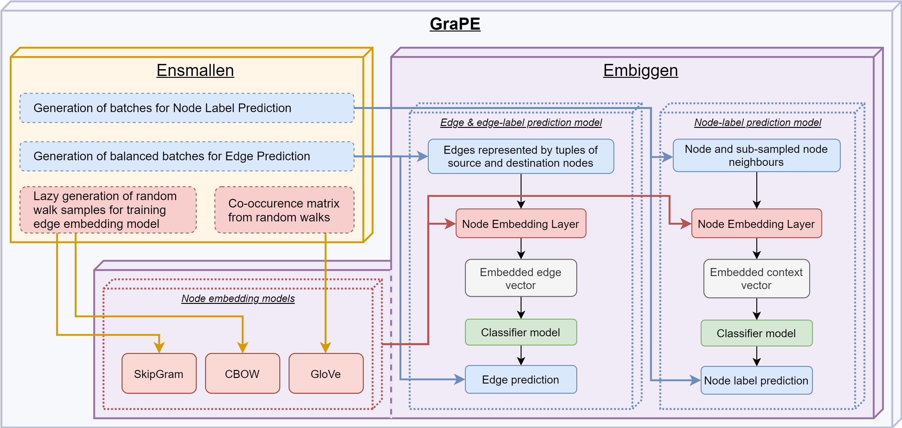

🍇 GRAPE
===================================
|pip| |downloads| |tutorials| |documentation| |python_version| |DOI| |license| |telegram| |discord| |twitter|

`GRAPE`_ (*Graph Representation leArning, Predictions and Evaluation*) is a fast graph processing and embedding library, designed to scale with big graphs and to run on both off-the-shelf laptop and desktop computers and High Performance Computing clusters of workstations.

The library is written in *Rust* and *Python* programming languages, and has been developed by `AnacletoLAB <https://anacletolab.di.unimi.it/>`_ (Dept.of Computer Science of the University of Milan), in collaboration with the `Robinson Lab - Jackson Laboratory for Genomic Medicine <https://www.jax.org/research-and-faculty/research-labs/the-robinson-lab>`_ and with the `BBOP - Lawrence Berkeley National Laboratory <http://www.berkeleybop.org/index.html>`_.

`GraPE`_ is composed of two main modules: `Ensmallen`_ (*ENabler  of  SMALL  runtimE  and  memory  Needs*) and `Embiggen`_ (*EMBeddInG  GENerator*), that run synergistically using parallel computation and efficient data structures.

`Ensmallen`_ efficiently executes graph processing operations including large-scale first and second-order random walks, while
`Embiggen`_ leverages the large amount of sampled random walks generated by `Ensmallen`_ by computing effective node and edge embeddings. 
Beside being helpful for unsupervised exploratory analysis of graphs, the computed embeddings can be used for trainining any of the flexible neural models for edge and node label prediction, provided by `Embiggen`_ itself.

The following figure shows the main relationships between `Ensmallen`_ and `Embiggen`_ modules:

Installation of `GraPE`_
----------------------------------------------

For most computers you can just download it using pip:

.. code:: shell

    pip install grape
    
Since Ensmallen is written in Rust, on PyPi we distribute pre-compiled packages for :code:`Windows, Linux, MacOs` for the Python version :code:`3.6+` for :code:`x86_64` and :code:`Arm` cpus.

For the Linux binaries we follow the `Python's ManyLinux2010 (PEP 571) <https://www.python.org/dev/peps/pep-0571/>`_ standard which requires libc version >= 2.12, this version was releasted in 03/08/2010 so any Linux System in the last ten years should be compatible. To check your current libc version you can run :code:`ldd --version`.

These requirements were chosen to provide a good tradeoff between compatability and performance. 
If your system is not compatible, you can `manually compile Ensmallen <https://github.com/AnacletoLAB/ensmallen/blob/master/bindings/python/README.md>`_ for any  Os, libc version, and CPU architecture (such as Arm, AArch64, RiscV, Mips) which are supported by Rust and LLVM. 
Manually compiling Ensmallen might require around half an hour and 10GB of RAM, if you encounter any error during the installation and/or compilation feel free to open an Issue here on Github and we will help troubleshoot it.

Main functionalities of the library
----------------------------------------------

* Robust graph loading and automatic graph retrieval:

     * More than 80000 graphs directly available from the library for benchmarking
     * Support for multiple graph formats
     * Automatic human readable reports of format errors
     * Automatic human readable reports of the main graph characteristics

* Random walks:

     * Exact and approximated first and second order random walks
     * Massive generation of sampled random walks for graph embedding
     * Automatic dispatching of 8 optimized random walk algorithms depending on the parameters of the random walk and the type (weighted/unweighted) of the graph

* Node embedding models:

    * SkipGram
    * CBOW
    * GloVe
    
* Edge and node prediction models:

    * Decision Trees
    * Random Forest
    * Perceptron
    * Multi-Layer Perceptron
    * Deep Neural Networks
    * Interface for general models
    * And more!

* Preprocessing for node embedding and edge prediction:

    * Lazy generation of skip-grams from random walks
    * Lazy generation of balanced batches for edge prediction
    * GloVe co-occurence matrix computation
    
* Graph processing operations:

    * Optimized filtering by node, edge and components characteristics
    * Optimized algebraic set operations on graphs
    * Automatic generation of reports summarizing graph features in natural language
    
* Graph algorithms:

    * Breadth and Depth-first search
    * Dijkstra, Tarjan's strongly connected component
    * Efficient Diameter computation, spanning arborescence and connected components
    * Approximated vertex cover, triads counting, transitivity, clustering coefficient and triangles counting
    * Betweenness and stress centrality, Closeness and harmonic centrality
    
* Graph visualization tools: visualization of node and edge properties
        

Tutorials
----------------------------------------------
You can find tutorials covering various aspects of the GraPE library `here <https://github.com/AnacletoLAB/grape/tree/main/tutorials>`_. All tutorials are as self-contained as possible and can be immediately executed on COLAB.

If you want to get quickly started, after having installed `GraPE`_ from Pypi as described above, you can try running the following example using the SkipGram embedding model on the Cora-graph:

.. code:: python

    from grape.datasets.linqs import Cora, get_words_data
    from grape.embedders import SkipGramEnsmallen
    from graph.edge_prediction import RandomForestEdgePrediction
    from grape import GraphVisualizer

    # Dowload, load up the graph and its node features
    graph, _ = get_words_data(Cora())
    
    # Create the model
    model = SkipGramEnsmallen()
    node_embedding = model.fit_transform(graph).get_node_embedding_from_index(0)

    # Visualize the obtained node embeddings
    visualizer = GraphVisualizer(graph, node_embedding_method_name="SkipGram")
    visualizer.fit_and_plot_all(node_embedding)
    plt.show()

You can `see a tutorial detailing the above script here <https://github.com/AnacletoLAB/grape/blob/main/tutorials/SkipGram_to_embed_Cora.ipynb>`_, and you `can run it on COLAB from here <https://colab.research.google.com/github/AnacletoLAB/grape/blob/main/tutorials/SkipGram_to_embed_Cora.ipynb>`_.

If you believe that any example may be of help, do feel free to `open a GitHub issue describing what we are missing in this tutorial <https://github.com/AnacletoLAB/grape/issues/new>`_.

Documentation
----------------------------------------------
On line documentation
~~~~~~~~~~~~~~~~~~~~~~~~~~~~~~~~~~~~~~~~~~~~~~
The on line documentation of the library is available `here <https://anacletolab.github.io/grape/index.html>`__.
Since Ensmallen is written in Rust, and PyO3 (the crate we use for the Python bindings), `doesn't support typing <https://github.com/PyO3/pyo3/issues/510>`_, the documentation is obtained generating an empty skeleton package. This allows to have a proper documentation but you won't be able to see the source-code in it. 

Using the automatic method suggestions utility
~~~~~~~~~~~~~~~~~~~~~~~~~~~~~~~~~~~~~~~~~~~~~~
To aid working with the library, Grape provides an integrated recommender system meant to help you either to find a method or, if a method has been renamed for any reason, find its new name.

As an example, after having loaded the `STRING Homo Sapiens graph <https://string-db.org/cgi/organisms>`_, the function for computing the connected components can be retrieved by simply typing components as follows: 

.. code:: python

    from grape.datasets.string import HomoSapiens

    graph = HomoSapiens()
    graph.components

The code above will raise the following error, and will suggest methods with a similar or related name:

.. code-block:: python

    AttributeError                            Traceback (most recent call last)
    <ipython-input-3-52fac30ac7f6> in <module>()
    ----> 2 graph.components

    AttributeError: The method 'components' does not exists, did you mean one of the following?
    * 'remove_components'
    * 'connected_components'
    * 'strongly_connected_components'
    * 'get_connected_components_number'
    * 'get_total_edge_weights'
    * 'get_mininum_edge_weight'
    * 'get_maximum_edge_weight'
    * 'get_unchecked_maximum_node_degree'
    * 'get_unchecked_minimum_node_degree'
    * 'get_weighted_maximum_node_degree'

In our example the method we need for computing the graph components would be `connected_components`.

Now the easiest way to get the method documentation is to use Python's `help <https://docs.python.org/3/library/functions.html#help>`_
as follows:

.. code:: python

    help(graph.connected_components)

And the above will return you:

.. code-block:: rst

    connected_components(verbose) method of builtins.Graph instance
    Compute the connected components building in parallel a spanning tree using [bader's algorithm](https://www.sciencedirect.com/science/article/abs/pii/S0743731505000882).
    
    **This works only for undirected graphs.**
    
    The returned quadruple contains:
    - Vector of the connected component for each node.
    - Number of connected components.
    - Minimum connected component size.
    - Maximum connected component size.
    
    Parameters
    ----------
    verbose: Optional[bool]
        Whether to show a loading bar or not.
    
    
    Raises
    -------
    ValueError
        If the given graph is directed.
    ValueError
        If the system configuration does not allow for the creation of the thread pool.

You can try `to run the code described above on COLAB <https://colab.research.google.com/github/AnacletoLAB/grape/blob/main/tutorials/Method_recommender_system.ipynb>`_.

Cite GraPE
----------------------------------------------
Please cite the following paper if it was useful for your research:

.. code:: bib

    @misc{cappelletti2021grape,
      title={GraPE: fast and scalable Graph Processing and Embedding}, 
      author={Luca Cappelletti and Tommaso Fontana and Elena Casiraghi and Vida Ravanmehr and Tiffany J. Callahan and Marcin P. Joachimiak and Christopher J. Mungall and Peter N. Robinson and Justin Reese and Giorgio Valentini},
      year={2021},
      eprint={2110.06196},
      archivePrefix={arXiv},
      primaryClass={cs.LG}
    }
    

.. |pip| image:: https://badge.fury.io/py/grape.svg
    :target: https://badge.fury.io/py/grape
    :alt: Pypi project

.. |downloads| image:: https://pepy.tech/badge/grape
    :target: https://pepy.tech/badge/grape
    :alt: Pypi total project downloads 

.. _Grape: https://github.com/AnacletoLAB/grape
.. _Ensmallen: https://github.com/AnacletoLAB/ensmallen

.. _Embiggen: https://github.com/monarch-initiative/embiggen

.. _AnacletoLAB: https://anacletolab.di.unimi.it/
.. _RobinsonLab: https://www.jax.org/research-and-faculty/research-labs/the-robinson-lab/
.. _BPOP: http://www.berkeleybop.org/index.html

.. |license| image:: https://img.shields.io/badge/License-MIT-blue.svg
    :target: https://opensource.org/licenses/MIT
    :alt: License

.. |tutorials| image:: https://img.shields.io/badge/Tutorials-Jupyter%20Notebooks-blue.svg
    :target: https://github.com/AnacletoLAB/grape/tree/main/tutorials
    :alt: Tutorials

.. |documentation| image:: https://img.shields.io/badge/Documentation-Available%20here-blue.svg
    :target: https://anacletolab.github.io/grape/index.html
    :alt: Documentation

.. |DOI| image:: https://img.shields.io/badge/DOI-10.48550/arXiv.2110.06196-blue.svg
    :target: https://doi.org/10.48550/arXiv.2110.06196
    :alt: DOI

.. |python_version| image:: https://img.shields.io/badge/Python-3.7+-blue.svg
    :target: https://pypi.org/project/embiggen/#history
    :alt: Supported Python versions

.. |twitter| image:: https://badges.aleen42.com/src/twitter.svg
    :target: https://twitter.com/grapelib
    :alt: Twitter

.. |telegram| image:: https://badges.aleen42.com/src/telegram.svg
    :target: https://t.me/grape_lib
    :alt: Telegram Group

.. |discord| image:: https://badges.aleen42.com/src/discord.svg
    :target: https://discord.gg/Nda2cqYvTN
    :alt: Discord Server

